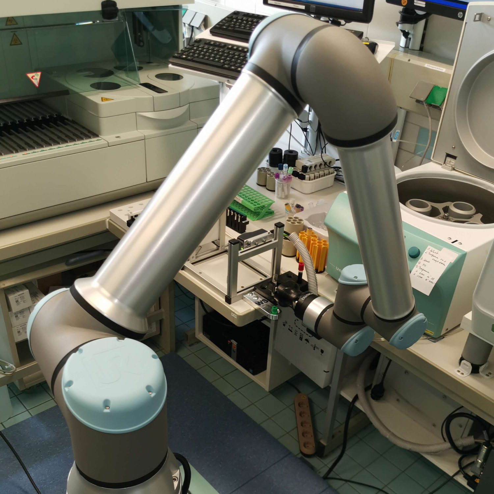
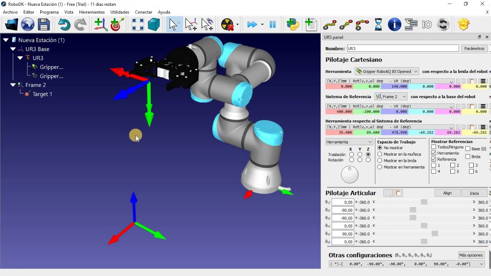

<br />
<div align="center">
	<a href="https://github.com/DarioArzaba/CobotURSimulation">
		
	</a>
	<h3 align="center">Cobot UR Inverse Kinematics</h3>
	<p align="center">
    	Scripts used to calculate and simulate the inverse kinematic motion of a UR10e robot.
  	</p>
</div>

## Installation

1. Download and install [RoboDK](https://robodk.com/download)
2. Download the [Virtual Machine](https://www.universal-robots.com/download/) (VMWare) for the UR10e robot
3. Clone the Repo
   ```sh
   git clone https://github.com/DarioArzaba/CobotURSimulation.git
   cd CobotURSimulation
   ```
4. Modify the desired parameters and movements of the robot at the end of the `FinalModuleInverseKinematic.py` Python script.
5. Open the virtual machine and upload the Python file to the virtual pendant.
6. Connect the virtual machine to the RoboDK simulation (local server) and run the simulation to see the results of the motion.

</br>
<div align="center"> <p> RoboDK simulation </p> </div>


* NOTE: MATLAB files require Peter Corke's [MATLAB Robotics Toolbox](https://github.com/petercorke/robotics-toolbox-matlab) to work properly.

## License

Distributed under the [MIT License](https://mit-license.org/).

## Contact

Dario Arzaba - dario.arzaba@gmail.com